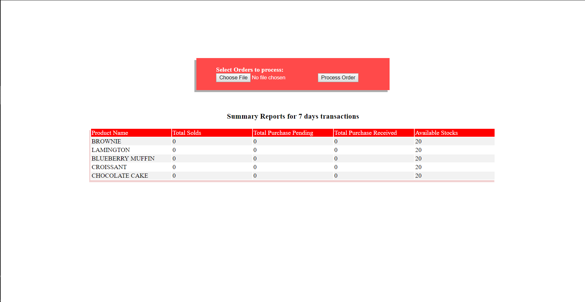

# Store Inventory



You are managing the inventory of a small sweet store that sells 5 products:
brownie, lamington, blueberry muffin, croissant, slice of chocolate cake 

```php
class Products
{
	public const BROWNIE = 1;
	public const LAMINGTON = 2;
	public const BLUEBERRY_MUFFIN = 3;
	public const CROISSANT = 4;
	public const CHOCOLATE_CAKE = 5;
}
```

For each product you will be required to track:
 
  - the total units sold
  - the total units purchased and pending
  - the total units purchased and received
  - the current stock levels 

Initially each product will start with a stock level of 20 units.
Every day for one week you will receive a list of orders with quantities to order for each product.
If any orders cannot be fulfilled because there is no stock, the whole order shall be rejected.

A sample json file of orders for each day is provided as `orders-sample.json`, 
and you'll need to use this as a basis for receiving and processing daily orders. 

It is in the following format:

```javascript
[
	// Monday orders
	[ 
		// Brownie: 2, Lamington: 1
		{"1": 2, "2": 1},
		// Blueberry Muffin: 1, Chocolate cake: 1
		{"3": 1, "5": 1}
	],
	// Tuesday orders
	[ 
		// Croissant: 3
		{"4": 3},
		// Brownie: 3, Blueberry Muffin: 2, Chocolate cake: 2
		{"1": 3, "3": 2, "5": 2}
	]
	// Other days orders...
]
```

At the end of each days orders, if stock level for any product falls below 10, a purchase order will need to be created to replenish the low stock items.
For each low stock item you will need to purchase 20 units, though those 20 units will not be received and added to the store inventory until the start of the second days trade from when the purchase order was placed.

For example if the stock for Lamingtons at the end of Monday is 8 units, a purchase order for 20 units is made that night, which would be expected to be received by start of trading for Wednesday.
On Tuesday 5 lamingtons are sold bringing the inventory down to 3 units. Lamingtons should not be added to a purchase order for that night as a pending purchase order is due the next morning.
A purchase order is then received for 20 lamingtons before start of trading on Wednesday, topping inventory up to 23 units.

So one trading day would include the following events:

 - Receive stock for any pending purchase orders made 2 days prior
 - Process all orders for that day
 - Place purchase order for all products low in stock (excluding items in a pending purchase order)

After 7 days of trading the program needs to output a nice summary for each product:

 - The total units sold
 - The total units purchased and pending
 - The total units purchased and received
 - The current stock level
  
## Provided Interfaces

For your solution there are four Php interfaces you must implement
 
`src/OrderProcessorInterface.php` Class to process orders and output a summary

`src/InventoryInterface.php` Class to manage inventory and track stock levels

`src/ProductsSoldInterface.php` Track total products sold for whole week

`src/ProductsPurchasedInterface.php` Track total products purchased for whole week

You may add methods to the interfaces as you see fit, but please do not change the provided methods

## Notes

Please clone this repository and provide your solution preferably under your own github account.

Minimum of PHP 7.1

Please consider relevant error handling and validation, documention for your code, and adding comments where helpful. 

Also add any relevant unit tests using whatever Php unit test framework you prefer.

To keep things simple you should not use any Php frameworks, or databases to store stock levels, everything should be stored in memory at runtime.
